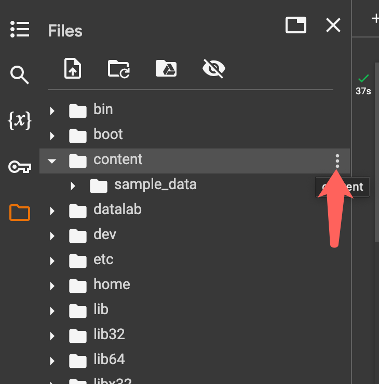

# Lab 2b: Generating Images with OpenAI’s Models

---

## 📘 Introduction

In this lab, you will learn how to harness the power of AI to create images from textual descriptions. More specifically, we will be utilizing DALL-E-2 via OpenAI to generate an image, given a prompt. This technology opens up new avenues for creativity and innovation in various fields, including marketing, design, and content creation. As we progress through this lab, you'll gain hands-on experience in using OpenAI's API, understand the process of generating images from text, and begin to explore the practical applications of this technology.

---

## 🎯 Learning Objectives

- **Understand the Capabilities of OpenAI's Image Generation Models:** Gain a foundational understanding of what OpenAI's image generation models like DALL-E-2 are capable of, including their strengths and limitations.
- **Develop Skills in Using OpenAI's API for Image Generation:** Learn to effectively utilize OpenAI's API to generate images, including setting up the necessary development environment, understanding API documentation, and executing API calls.
- **Download Images from a URL:** Learn how to programmatically download images from a specified URL using Python. This involves understanding how to send a web request and save the resulting image in a local directory.

<div align="left">
  
  
</div>


---

## ⏱️ Estimated Time
3 hours

---

## 💵 Estimated Cost
$1 (View your OpenAI usage [here](https://platform.openai.com/usage))

---

## 🧰 Materials

- OpenAI account & API key  
- [Image Generation Colab](https://colab.research.google.com/drive/1uzJhhuaX0oUDPt0lcXcSA4FuXzWq6_BN?usp=sharing)

---

## ⚙️ 1.1 Setting Up Your Development Environment

1. **Make a copy** of the [Image Generation Colab](https://colab.research.google.com/drive/1uzJhhuaX0oUDPt0lcXcSA4FuXzWq6_BN?usp=sharing)

2. To set up your development environment, you will need to have Python installed. You will also need to install the OpenAI Python library, which we will use to generate text in this lab, and the requests library, which we will use to download images from a given URL. You can run the following shell scripts, which are also pre-written in the first cell of your Colab notebook, to do so.

```Python
# Uninstall Colab's preinstalled modules which have dependency conflicts with
# the OpenAI Python library.
!pip uninstall tensorflow-probability -y
!pip uninstall llmx -y
# Install the OpenAI Python library.
!pip install --upgrade openai
# Install the requests library, which is useful for working with HTTP requests.
!pip install --upgrade requests
```

3. We also want to create a folder to save the images that we generate in. Navigate to the “Files” section of the left sidebar by clicking on the file icon.

<div align="left">
  
</div>

4. In Files, you will see a folder named sample_data. Navigate to its parent folder by clicking the file icon which has an up arrow inside.

<div align="left">
  
</div>

5. Find the content folder, and within it create a new folder named “images”.

<div align="left">
  
  
</div>

<div align="left">
  
</div>

6. Now, locate your OpenAI API key. You may already have one from a previous lab; if not, please refer to the Setup Lab for instructions.

   
---


## 📥 1.2 Importing and Initializing OpenAI

1. Now that you have the OpenAI Python library installed, we can begin to code. At the top of your cell, import requests and OpenAI.

```Python
import requests
from openai import OpenAI
```

2. Next, initialize an OpenAI object. This will allow you to use the OpenAI API to communicate with OpenAI’s models. Make sure to **replace** your-api-key-here with your API key.

```Python
client = OpenAI(api_key='your-api-key-here')
```

---


## 🖼️ 2.1 Function to Download an Image from a Given URL

1. Create a function titled download_image with 2 parameters **filename** and **url**
   - This function will be used to download an image from a given web URL.

```Python
def download_image(filename, url):
```

2. In the **download_image** function, requests are sent to retrieve images from their URLs. 

**requests.get(url)** sends a GET request to the specified url. A status code of 200 for requests means that the request was fulfilled by the server successfully.

**'wb'** represents the file permissions enabled. **w** for ‘write’ and **b** for ‘binary’ indicates that the file is being written in binary.

```Python
def download_image(filename, url):
    response = requests.get(url)
    if response.status_code == 200:
        with open(filename, 'wb') as file:
            file.write(response.content)
    else:
        print("Error downloading image from URL:", url)
```

---


## 📝 2.2 Function to Specify a Filename Based on the User Input 


1. Create a function titled filename_from_input with 1 parameter prompt
   - This function will generate a file name from the user’s input and adjust it for a suitable title.

```Python
def filename_from_input(prompt):
```

2. The **filename_from_input** function also reduces the possibility of the code running into an error when saving the image as a download. 

By filtering the prompt from the input, any character other than the alphabet or numbers are removed to ensure that the prompt doesn’t contain (/) to intervene with saving the image to folders. 

The title of the image is also limited to a maximum of 3 words to ensure a brief title. 

```Python
def filename_from_input(prompt):
    # Remove all non-alphanumeric characters from the prompt except spaces.
    alphanum = ""
    for character in prompt:
        if character.isalnum() or character == " ":
            alphanum += character
    # Split the alphanumeric prompt into words.
    # Take the first three words if there are more than three. Else, take all of them.
    alphanumSplit = alphanum.split()
    if len(alphanumSplit) > 3:
        alphanumSplit = alphanumSplit[:3]
    # Join the words with underscores and return the result.
    return "images/" + "_".join(alphanumSplit)
```


---


## 🎨 2.3 Function to Create an Image

1. Create a function titled **get_image** with 2 parameters prompt and model= **"dall-e-2"**.
   - This function will prompt the specified OpenAI model with the user’s input (prompt) to generate and return a desired response.

```Python
def get_image(prompt, model="dall-e-2"):
```

2. The **client.images.generate** is a function from the OpenAI Python Library which generates an image based on the prompt it is given. It has 2 required parameters: model and prompt. 

**model** is specified as a string, the name of one of OpenAI’s different image generation models (i.e. dall-e-2, dall-e-3). Different models can be selected for different purposes and results.

Inside the function, **prompt** passes the input from the user to OpenAI, the variable n represents the number of images to generate, and **size** as the dimensions in pixels for the image generated. 


```Python
def get_image(prompt, model="dall-e-2"):
    n = 2   # Number of images to generate
    image = client.images.generate(
        prompt=prompt,
        model=model,
        n=n,
        size="1024x1024"
    )

    # There is more to this code!...
```

3. For each image that was generated, **filename_from_input** is called to create a suitable name and downloaded with the download_image function.


```Python
def get_image(prompt, model="dall-e-2"):
    n = 2   # Number of images to generate
    image = client.images.generate(
        prompt=prompt,
        model=model,
        n=n,
        size="1024x1024"
    )

    # Download the image
    for i in range(n):
        filename = filename_from_input(prompt) + "_" + str(i+1) + ".png"
        download_image(filename, image.data[i].url)

    return image
```


---


## 🧪 3.1 Using the Function with User Input


1. Now we have a function that can prompt the OpenAI model to generate an image, then download it to the images folder. Let’s test it out! First, ask the user for an input and store it in a variable named prompt.

```Python
prompt = input("Enter a prompt: ")
```

2. Pass the input through the **get_image** function and store it in a variable named response.

```Python
response = get_image(prompt)
```

3. Next, display the response from OpenAI. Note that this prints the data in the ImagesResponse object and does not visually display the images that were generated. We will view the images that were generated in the next section.

```Python
print(response)
```

4. Finally, let's display a feedback message with the path to the images. This message also lets the user know that the images have been saved successfully. 

```Python
# Feedback message
print("----------------------------------------------")
print("Image saved to", filename_from_input(prompt) + "_*.png!")
```

---


## 🖥️ 3.2 Display Your Image Using Google Colab
1. Now that you have retrieved and downloaded your generated images from OpenAI, it is time to display and see them. First, import **Image** and **display** from **IPython.display**.

```Python
from IPython.display import Image, display
```

2. To display an image in Colab, use the **display** and **Image** function imported, and pass the name of the image file as an argument. 

```Python
# Display the first image
display(Image(filename_from_input(prompt) + '_1.png'))

# Display the second image
display(Image(filename_from_input(prompt) + '_2.png'))

# If you have more images to display, copy the above and replace the numbers to represent the 3rd, 4th, and so on...
```

3. Now you can see the images you generated!

4. After you finish your lab, check your OpenAI usage [here](https://platform.openai.com/usage) to get a sense of the cost associated with the Open AI API calls. Take a screenshot of your usage, including “Cost” and “Activity”. Compare the cost of generating images in Lab 3 and generating text in Lab 2.


---

## ✅ Congratulations, you have successfully finished the lab!
Please submit your work as a PDF file with 
1) a Colab link
2) the prompt you used
3) screenshots of your output
4) screenshots of your usage page including both Cost and Activity

To help the teaching team grade your lab effectively and to protect your API security, please follow these steps before submitting:
   1. Update your Colab setting so that everyone in SJSU group can be a viewer;
   2. Please change your API key in your code to “my-api-key-here”


---


## 🔗 References

- [OpenAI Quickstart](https://platform.openai.com/docs/quickstart?lang=Images)
- [OpenAI Chat API Docs](https://platform.openai.com/docs/api-reference/images)


   


